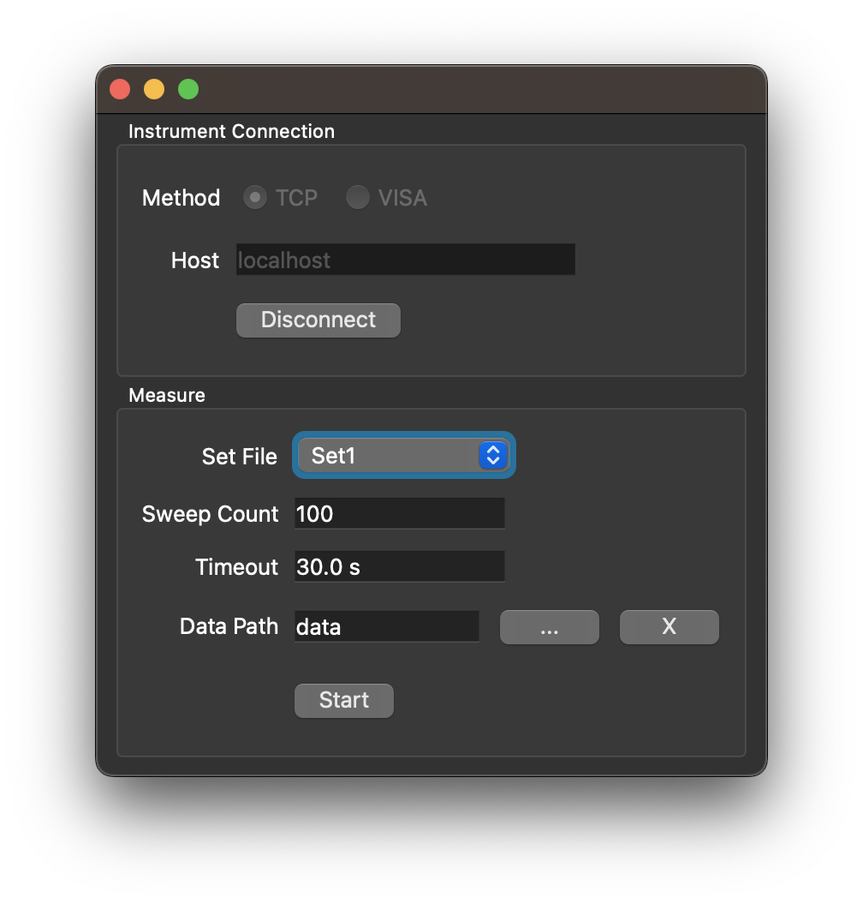

# Trace History GUI

Graphical User Interface for the Rohde & Schwarz Trace History command line utility for ZNX-series Vector Network Analyzers.



## Requirements

This application was developed with Python 3.11.6 and the following python packages, all available from pypi:

-   qtrf         >=2.2.1, <3
-   appdirs      >=1.4,   <2
-   pyside6      >=6.6,   <7
-   rohdeschwarz >=1.13.0.dev1, <2",
-   si-prefix    >=1.2,   <2"

## Getting Started

### Clone Repository with Submodules

This project uses git submodules. To retrieve submodules while cloning, use the `--recurse-submodules` flag:

```shell
git clone --recurse-submodules https://github.com/Terrabits/trace-history.git
```

### Update Submodules

To fetch submodules after cloning, or to update submodules, use the following:

```shell
cd path/to/trace-history-gui
git submodule update --init --recursive
```

### Install

First install libs (i.e. `libs/trace-history`):

```shell
cd path/to/trace-history-gui
scripts/install-libs[.bat]
```

Then install this project:

```shell
cd path/to/trace-history-gui
scripts/install[.bat]
```

### Start Application

#### From Command Line
To start the application, run the following from the command line:

```shell
cd path/to/trace-history-gui
scripts/start[.bat]
```

The application includes the following command line options:

```comment
usage: trace-history-gui [-h] [-d]

Rohde & Schwarz Trace History Graphical User Interface

options:
  -h, --help  show this help message and exit
  -d, --demo  Run in demo mode
```

#### From OS GUI

Double-click `scripts/start[.bat]` to start the application from the OS GUI.
